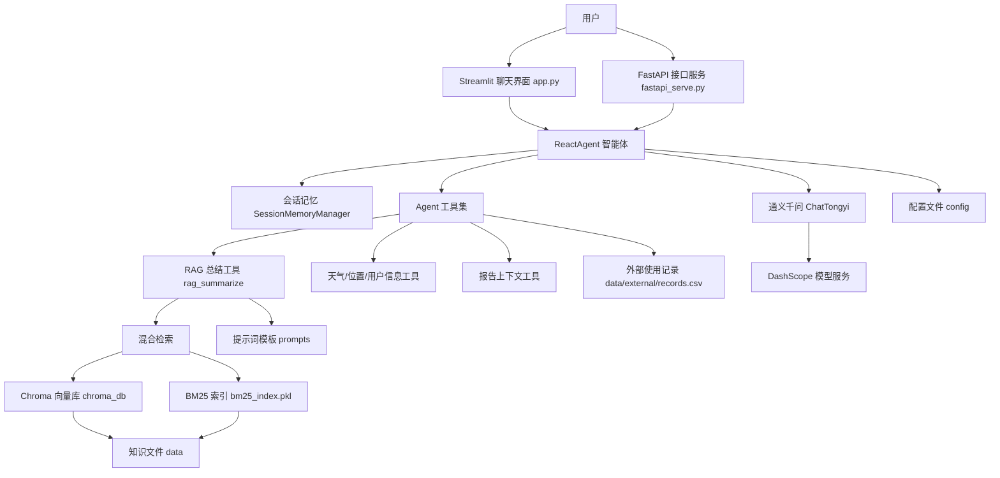

# 智扫通 Agent

智扫通 Agent 是一个面向扫地机器人场景的智能客服与知识问答项目。项目基于 LangChain Agent 构建智能体，结合本地知识库 RAG 检索、会话记忆、工具调用和大模型推理，为用户提供扫地机器人选购、使用、维护、故障排查、使用报告生成等问答能力。

项目同时提供两种访问方式：

- Streamlit Web 页面：用于本地可视化聊天测试。
- FastAPI 接口服务：用于对外提供 HTTP API 调用能力。

## 技术架构



## 目录结构

```text
.
├── app.py                  # Streamlit 聊天页面入口
├── fastapi_serve.py        # FastAPI 对外接口入口
├── agent/                  # Agent 核心逻辑、工具和中间件
├── rag/                    # RAG 检索与总结服务
├── model/                  # 大模型与 Embedding 模型工厂
├── config/                 # 模型、向量库、提示词、Agent 配置
├── prompts/                # 系统提示词、RAG 提示词、报告提示词
├── data/                   # 知识库资料和外部模拟数据
├── utils/                  # 配置、日志、路径、文件处理工具
├── chroma_db/              # 本地 Chroma 向量库运行数据，通常不提交 Git
└── logs/                   # 运行日志，通常不提交 Git
```

## 环境准备

建议使用 Python 3.10 或以上版本。当前项目使用了 LangChain、Streamlit、FastAPI、Chroma、DashScope 等依赖。

1. 进入项目目录：

```powershell
cd "C:\develop\PycharmPrrojects\智扫通Agent项目"
```

2. 创建并激活虚拟环境：

```powershell
python -m venv .venv
.\.venv\Scripts\activate
```

3. 安装依赖：

```powershell
pip install streamlit fastapi uvicorn pydantic pyyaml langchain langchain-core langchain-community langchain-classic dashscope chromadb rank-bm25 sentence-transformers pypdf
```

如果你已经在 PyCharm 中配置好了 `.venv`，也可以直接使用现有虚拟环境。

4. 配置 DashScope API Key：

```powershell
$env:DASHSCOPE_API_KEY="你的 DashScope API Key"
```

如果希望长期生效，可以在 Windows 系统环境变量中新增 `DASHSCOPE_API_KEY`。

## 配置说明

核心配置文件位于 `config/` 目录：

- `config/rag.yml`：配置聊天模型和 Embedding 模型，例如 `qwen3-max`、`text-embedding-v4`。
- `config/chroma.yml`：配置知识库路径、Chroma 持久化目录、检索参数、BM25 和 rerank 参数。
- `config/prompts.yml`：配置提示词文件路径。
- `config/agent.yml`：配置 Agent 运行所需的外部数据路径。

知识库文件默认放在 `data/` 目录，支持的文件类型由 `config/chroma.yml` 中的 `allow_knowledge_file_type` 控制。

## 运行 Streamlit 聊天页面

启动命令：

```powershell
streamlit run app.py
```

启动后浏览器会打开本地页面，通常地址类似：

```text
http://localhost:8501
```

在页面中可以进行多轮对话、创建新会话、切换历史会话，并测试智能客服问答能力。

## 运行 FastAPI 接口服务

启动命令：

```powershell
uvicorn fastapi_serve:app --host 0.0.0.0 --port 8000 --reload
```

启动后可以访问接口文档：

```text
http://127.0.0.1:8000/docs
```

### 健康检查

```powershell
curl http://127.0.0.1:8000/
```

### 同步问答接口

```powershell
curl -X POST "http://127.0.0.1:8000/api/query_sync" `
  -H "Content-Type: application/json" `
  -d "{\"query\":\"扫地机器人适合小户型吗？\"}"
```

### 流式问答接口

```powershell
curl -X POST "http://127.0.0.1:8000/api/query" `
  -H "Content-Type: application/json" `
  -d "{\"query\":\"如何维护扫地机器人？\"}"
```

### 工具列表接口

```powershell
curl http://127.0.0.1:8000/api/tools
```

## RAG 知识库说明

项目会从 `data/` 目录读取知识资料，并结合 Chroma 向量检索、BM25 检索和 rerank 结果，为 Agent 提供参考上下文。

常见资料包括：

- 扫地机器人 100 问
- 扫拖一体机器人问答资料
- 故障排除资料
- 维护保养资料
- 选购指南
- 外部用户使用记录 `data/external/records.csv`

如果新增知识文件，建议放入 `data/` 目录，并确保文件类型在 `config/chroma.yml` 的 `allow_knowledge_file_type` 中。

## Git 使用

项目已经初始化为 Git 仓库，并配置远程仓库：

```text
https://github.com/dengxiaocui-123/zhisaotong-agent.git
```

提交并推送更新：

```powershell
git add .
git commit -m "Update README"
git push
```

如果当前终端找不到 `git` 命令，可以使用完整路径：

```powershell
C:\develop\Git\cmd\git.exe add .
C:\develop\Git\[app.py](app.py)cmd\git.exe commit -m "Update README"
C:\develop\Git\cmd\git.exe push
```

## 注意事项

- `.venv/`、`.idea/`、`logs/`、`chroma_db/`、`__pycache__/`、`*.pkl` 等运行环境和缓存文件不建议提交到 Git。
- 首次运行前需要确认 DashScope API Key 已正确配置。
- 如果修改了知识库资料，可能需要重新构建或刷新向量库和 BM25 索引。
- FastAPI 服务用于系统集成，Streamlit 页面用于本地演示和调试。
